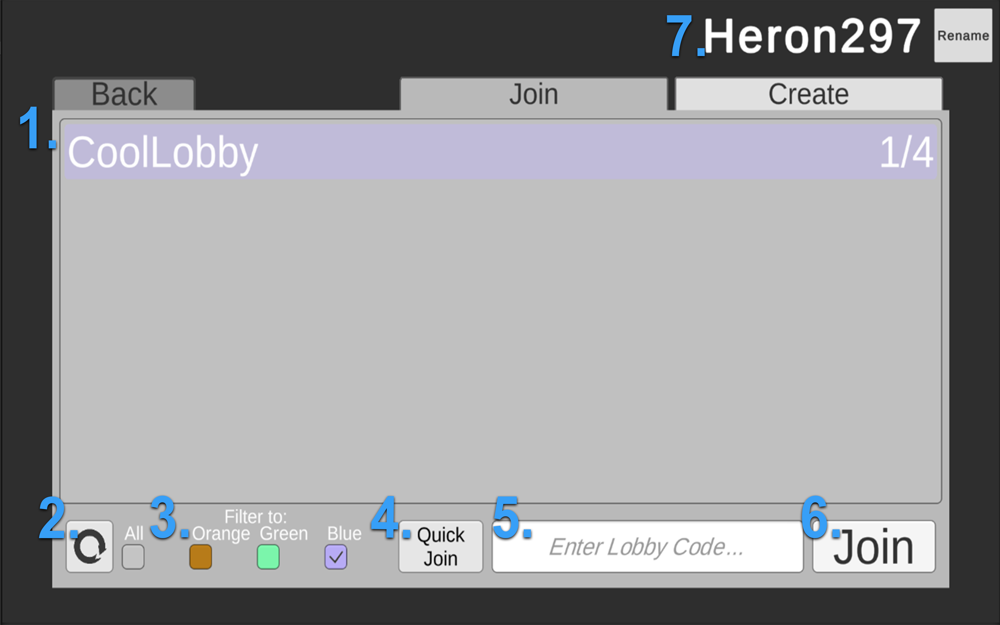
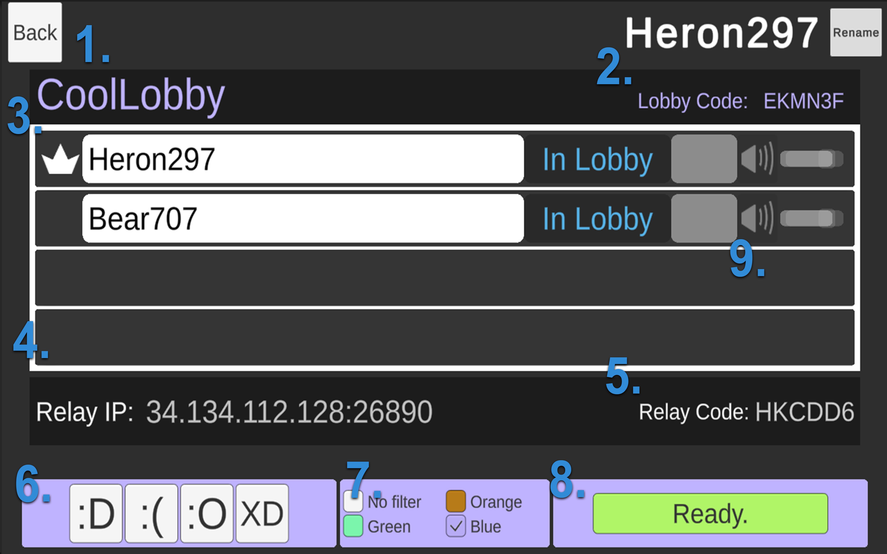

# Game Lobby Sample

_Tested with Unity 2020.3 for PC and Mac._

This sample demonstrates how to use the Lobby and Relay packages to create a typical game lobby experience. It also includes Vivox Voice chat. Players can host lobbies that other players can join using a public lobby list or lobby code, and then connect with Relay to use Unity Transport ("UTP") for basic real-time communication between them. Relay allows players to securely communicate with each other while maintaining connection anonymity. Connecting to the lobby will also connect to Vivox to enable voice chat as long as an audio input device is available.

**Note**: This is not a “drag-and-drop” solution; the Game Lobby Sample is not a minimal code sample intended to be completely copied into a full-scale project. Rather, it demonstrates how to use multiple services in a vertical slice with some basic game logic and infrastructure. Use it as a reference and starting point to learn how Lobby and Relay work together and how to integrate them into your project.

#### Features:

* **Anonymous Auth login**: Track player credentials without a persistent account.
* **Lobby creation**: Players host lobbies for others to join.
* **Lobby query**: Find a list of lobbies with filters, or use lobby codes.
* **Relay obfuscation**: Players in a lobby are connected through an anonymous IP.
* **UTP communication**: Players transmit basic data to lobby members in real time.
* **Lobby + Relay connection management**: Together, the services automatically handle new connections and disconnections.
* **Vivox Voice**: Create a voice channel for the lobby to allow for voice communication, with per-user volume control and muting.

### Service organization setup

To use Unity’s multiplayer services, you need a cloud organization ID for your project. If you do not currently have one, follow the **How do I create a new Organization?** article to set up your cloud organization:

[https://support.unity.com/hc/en-us/articles/208592876-How-do-I-create-a-new-Organization-](https://support.unity.com/hc/en-us/articles/208592876-How-do-I-create-a-new-Organization-)

Once you have an ID, link it to your project under **Edit **>** Project Settings **>** Services** and use the Unity Dashboard to manage your project’s services.

### Service overview

#### **Lobby**

The Lobby service allows developers to create lobbies and share data between players before a real-time network connection is established. It simplifies the first step in connecting users to other services such as Relay and provides tools to allow players to find other lobbies.

The Lobby documentation contains code samples and additional information about the service. It includes comprehensive details for using Lobby along with additional code samples, and it might help you better understand the Game Lobby Sample: [http://documentation.cloud.unity3d.com/en/articles/5371715-unity-lobby-service](http://documentation.cloud.unity3d.com/en/articles/5371715-unity-lobby-service)

The Lobby service can be managed in the Unity Dashboard:

[https://dashboard.unity3d.com/lobby](http://documentation.cloud.unity3d.com/en/articles/5371715-unity-lobby-service)

#### **Relay**

The Relay service connects players in a host-client model with an obfuscated host IP. This allows players to host networked experiences as though players connected directly while only sharing private information with Relay itself. \

The Relay documentation contains code samples and additional information about the service. It includes comprehensive details for using Relay along with additional code samples, and it might help you better understand the Game Lobby Sample: 

[http://documentation.cloud.unity3d.com/en/articles/5371723-relay-overview](http://documentation.cloud.unity3d.com/en/articles/5371723-relay-overview)

The Relay service can be managed in the Unity Dashboard:

[https://dashboard.unity3d.com/relay](http://documentation.cloud.unity3d.com/en/articles/5371723-relay-overview)

In this sample, once players are connected to a lobby, they are connected through Relay to set up real-time data transfer over UTP. Lobby and Relay both depend on Auth for credentials. This sample uses Auth’s anonymous login feature to create semi-permanent credentials that are unique to each player but do not require developers to maintain a persistent account for them. \

**Vivox**
The Vivox Service provides player voice and text chat rooms for in-app communication. It also sports useful features like spatial audio and chat transcription.
 
The Vivox Documentation contains code samples and additional information about the service. It includes comprehensive details for using Vivox along with additional code samples, and it might help you better understand the Game Lobby Sample: 
[https://docs.vivox.com/v5/general/unity/5_15_0/en-us/Default.htm](https://docs.vivox.com/v5/general/unity/5_15_0/en-us/Default.htm)

 
Vivox can be managed in the Unity Dashboard: 
[https://dashboard.unity3d.com/vivox](https://dashboard.unity3d.com/vivox)

#### **Setup **

The Lobby and Relay sections of the Unity Dashboard contain their own setup instructions. Select **About & Support **>** Get Started** and follow the provided steps to integrate the services into your project.

With those services set up and your project linked to your cloud organization, open the **mainScene** scene in the Editor and begin using the Game Lobby Sample.

### Running the sample

You will need two “players” to demonstrate the full sample functionality. Create a standalone build to run alongside the Editor in Play mode. Although Auth creates anonymous credentials using your machine’s registry, your Editor and your build have different credentials because they create different registry entries.

#### **Lobby Join Menu**

The Lobby Join menu contains the lobby list UI, which acts as a hub for players to connect to each other using the public lobby list or lobby code.

A. **Public lobby list**: Shows all lobbies not set to private. Lobbies contain developer-defined data which can be set to public and non-public visibility. The Lobby service cleans up any “zombie” rooms so they don’t appear in this list. For this sample, lobby names and player counts are shown, and lobbies in the “in-game” state are not shown. You can select a lobby and then select **Join**.
B. **Refresh icon**: Refreshes the Lobby List. The Lobby service imposes rate limits on all API calls to prevent spamming. Refresh attempts within the rate limit will do nothing (approximately every 1.5 seconds, see [Lobby documentation](http://documentation.cloud.unity3d.com/en/articles/5371715-unity-lobby-service) for details).
C. **Filters**: Sets the Lobby List to only show servers of a certain color. The Lobby service can filter any queries by data set to public visibility. For this sample, players can optionally filter by color, which hosts set for their lobbies.
D. **Quick Join button: **Join the first available lobby in the list that matches your filters.
E. **Lobby Code field**: Enter a lobby code for an existing lobby. In addition to the public lobby list, all lobbies can be joined using their codes. This allows players to privately share access to lobbies.
F. **Join**:** **Requests to join by public lobby list selection or lobby code. Failed requests are also rate limited to prevent spam, if the player presses the button repeatedly.
G. **Create**: Allows creation of a new lobby. Players select a lobby name and whether to make a private lobby, and they then connect to the new lobby as its host.
H. **Player name**: Displays the player name and allows renaming. By default, players are assigned a name based on their anonymous Auth credentials, but name changes follow their credentials so that all players see the new name.

**Lobby View**

The Lobby View UI displays information from Lobby and Relay for all players in a lobby. When a new player joins, they immediately begin connecting to the host, after which they synchronize emotes and state changes with the other lobby members.

A. **Lobby name**: Set when the lobby was created and cannot be changed.
B. **Lobby code**: Shareable code generated by the Lobby service. This may be provided externally to other players to allow them to join this lobby.
C. **Lobby user**: A player in the lobby. The player’s name, state, and emote are displayed; this data is synchronized through Relay + UTP, so any changes that a player makes will appear immediately for all connected players. Incoming players will be sent the current data once they have connected.
D. **Emotes**: Shows the player’s Emote, as well as controls for voice chat if the user has a mic connected. 
E. **Vivox Voice Controls: **Clicking the audio icon will mute/unmute that user.
F. **Relay IP**:** **The anonymous server IP that Relay generates. This does not need to be shown to players and is displayed here simply to indicate that Relay is functioning.
G. **Relay Code**: An internal join code generated by Relay that is used during Relay connection. This does not need to be shown to players and is displayed here simply to indicate that Relay is functioning.
H. **Emote buttons:**: Sets the player’s emote and is synchronized using UTP.
I. **Lobby color**: (Host only) Sets the lobby color for filtering in the Lobby List. This is synchronized through Lobby, so changes won’t appear immediately for all players because Lobby queries are rate limited. See Rate Limits.
J. **Ready button**: Sets a ready state on the player. When all players are ready, the host initiates a countdown to an “in-game” state, and the lobby becomes hidden from the public lobby list.

### Architecture

The Game Lobby Sample is designed as a vertical slice of a multiplayer lobby, so it has additional infrastructure that might be expected in full game production, as well as some components to allow multiple services to work together. As such, not all of the codebase will be relevant depending on your needs. Most contents are self-documenting, but some high-level points follow:

* Logic for using the Auth, Lobby, and Relay services are encapsulated in their own directories. Much of the API usage is abstracted away for convenience. 
    * For example, **LobbyAPIInterface** contains the actual calls into the Lobby API, but **LobbyAsyncRequests** has additional processing on the results of those calls as well as some structures necessary for timing the API calls properly.
    * The Relay directory also contains logic for using the Unity Transport (UTP) because it requires a transport to function.
* The **Game** directory contains core “glue” classes for running the sample itself, representing a simple framework for a game.
    * **GameManager** has all the core logic for running the sample. It sets up the services and UI, manages game states, and fields messages from other components.
    * Various other classes exist here to maintain the states of multiple components of the sample and to interface between our sample’s needs for Lobby and Relay data and the structure of that data remotely in the services.
* The **Infrastructure** directory contains classes used for essential tasks related to overall function but not specifically to any service.
    * **Locator **mimics a Service Locator pattern, allowing for behaviors that might otherwise be Singletons to easily be swapped in and out.
    * **Messenger **creates a simple messaging system used to keep unrelated classes decoupled, letting them instead message arbitrary listeners when interesting things happen. For example, a lobby is updated, or a player disconnects from a relay.
    * An** Observer** pattern is used for all UI elements and for local copies of remote Lobby and Relay data. An Observer is alerted whenever its observed data changes, and the owner of that data doesn’t need to know who is observing.
* The **UI **directory strictly contains logic for the sample’s UI and observing relevant data. Viewing these files should not be necessary to understand how to use the services themselves, though they do demonstrate the use of the Observer pattern.
    * Several files exist with classes that simply implement **ObserverBehaviour**. This is because Unity requires **MonoBehaviours** to exist in files of the same names.
    * Note that much of the UI is driven by **CanvasGroup** alpha for visibility, which means that some behaviors continue to run even when invisible to the player.
* Multiple **Tests** directories are included to demonstrate core behavior and edge cases for some of the code. In particular, the Play mode tests for Lobby and Relay can be used to ensure your connection to the services is functioning correctly. (Run tests using the Test Runner, accessible under **Window > General > Test Runner**.)
* In the Editor, the project assets are broken into nested prefabs for convenience when making changes during sample development. Their details should not be considered vital, although there are UI elements that depend on event handlers that are serialized.

### Considerations

While the Game Lobby Sample represents more than just a minimal implementation of the Lobby and Relay services, it is not comprehensive and some design decisions were made for faster or more readable development.

* All operations using Lobby and Relay rely on asynchronous API calls. The sample code has some logic for handling issues that can result from receiving the results at arbitrary times, but it doesn’t have logic for enqueuing calls that the user initiates during setup and cleanup. Rapid operations when entering and exiting lobbies can result in unexpected behavior.
* Relay does not support host migration, but Lobby does. If a lobby host disconnects, the lobby might seem to clients to continue to operate until Lobby detects the disconnect. In practice, you might want to implement an additional periodic handshake between hosts and clients in cases where data could get out of sync quickly.
* The sample sets up heartbeat pings with Lobby and Relay to keep the connections alive, but they do not impose any limitations on a lobby’s duration. Consider a maximum duration in actual use, such as a maximum game length.
* HTTP errors will appear in the console. These are returned by Lobby and Relay API calls for various reasons. In general, they do not impact the sample’s execution, though they might result in unexpected behavior for a player since the sample doesn’t provide any explanatory UI when these errors occur.
    * **List of HTTP errors:**
        * **404 (“Not Found”) errors** might occur when the Lobby service handles multiple incoming API calls in an arbitrary order, usually when leaving a lobby. They will also occur if trying to join an invalid lobby, such as one that has been deleted but still appears in the lobby list before refreshing.
        * **429 (“Too Many Requests”) errors** occur if rate limited operations happen too quickly. In particular, refreshing the lobby list too quickly results in 429 errors from the **QueryLobbiesAsync** call. Consult the Lobby documentation for details.
        * **401 (“Unauthorized”) errors** occur if the user enters the lobby menu before Auth sign-in completes, since all Lobby and Relay operations require Auth credentials.
        * **409 (“Conflict”) errors** occur if a player tries to join a lobby using the same credentials as another player. In particular, this will happen if you are trying to test with multiple standalone builds, since they share the same registry entry on your machine. To test with three or more players on one machine:
            * Create a duplicate project with Symbolic Links to the original **Assets **and **Packages**, so that it uses the same assets. Copy the **ProjectSettings** as well, but do not link them to the original. Note that the process for creating Symbolic Links will depend on your operating system.
            * Open this project in a second Editor.
            * Under **Edit **>** Project Settings **>** Player**, modify the **Product Name**. This causes the duplicate project to have a new registry entry, so Auth will assign new credentials.
            * Verify that running the sample in either Play mode or a standalone build assigns a different default player name than the original. This indicates different Auth credentials, preventing the 409 errors.